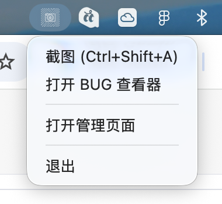
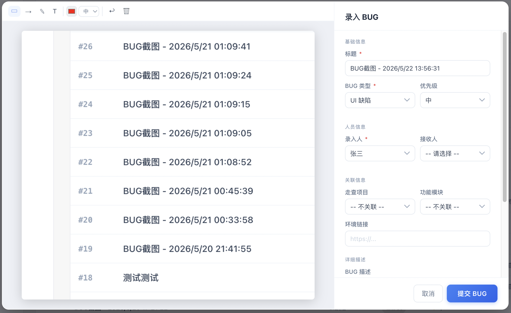
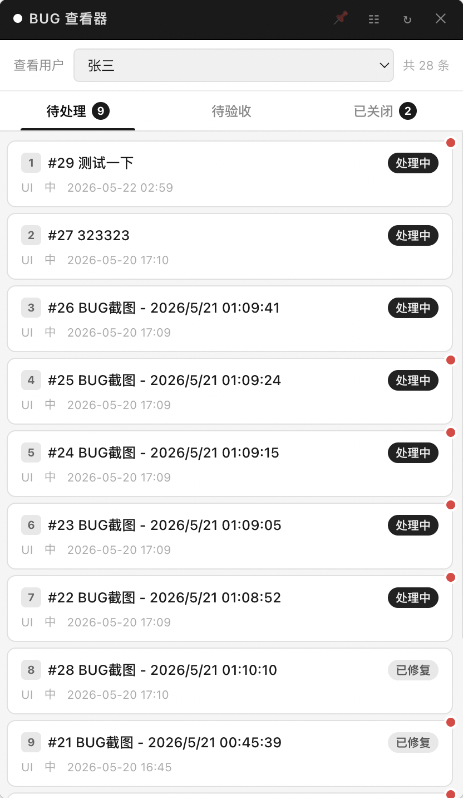
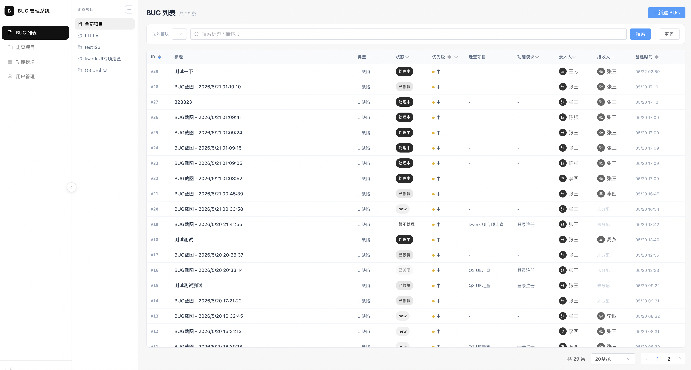

# BUG 录入与走查管理工具

一套三端联动的内部 BUG 管理工具，专为 UI 走查场景设计。

> ⚠️ **macOS 用户必读：首次运行前请完成以下设置**
>
> 从 Git clone 后首次打开 `.command` 文件或 Electron 应用时，macOS 会阻止运行。请按以下步骤解除：
>
> **步骤一：解除文件权限限制**
> ```bash
> cd /path/to/BugTool
> chmod +x 首次安装.command 启动BUG工具.command start.sh stop.sh
> xattr -cr .
> ```
>
> **步骤二：允许打开未验证的应用**
> 1. 双击文件，弹出「无法打开」提示后点击「好」
> 2. 打开 **系统设置 → 隐私与安全性**
> 3. 滚动到底部，点击 **仍要打开**
> 4. （或者右键文件 → 打开 → 在弹窗中点击「打开」）
>
> **步骤三：授予屏幕录制权限（截图功能需要）**
> - 系统设置 → 隐私与安全性 → 屏幕录制 → 勾选启动截图工具的终端应用

## 系统架构

| 端 | 技术栈 | 用途 |
|----|--------|------|
| 后端 API | Python · FastAPI · SQLite · SQLAlchemy | 数据存储与业务逻辑 |
| WEB 管理端 | Vue 3 · Vite · Element Plus · Pinia | BUG 列表管理、详情查看、人员/模块维护 |
| Electron 截图工具 | Electron · TypeScript | 截图 → 标注 → 提交 BUG；悬浮 BUG 查看器 |

## 核心流程

1. 测试人员按 `Ctrl+Shift+A` 唤起截图工具
2. 框选区域 → 在截图上标注（矩形框/箭头/画笔/文字）
3. 点击「录入」填写表单 → 提交，截图自动上传到后端
4. 开发人员打开 BUG 查看器（托盘菜单）查看待处理 BUG，更新状态
5. 管理人员在 WEB 端统一查看、筛选、管理所有 BUG

### 界面预览

**托盘菜单 — 快速入口**



**截图标注 + BUG 录入弹窗**



**BUG 查看器 — 悬浮窗口**



**WEB 管理端 — BUG 列表**



## 快速开始

### 环境要求

- Node.js >= 18
- Python >= 3.9
- macOS（截图功能依赖系统 `screencapture` 命令）

### 安装依赖

**方式一：双击安装（推荐）**

从 Git clone 后，在终端运行一次：
```bash
chmod +x 首次安装.command 启动BUG工具.command
```
然后双击「首次安装.command」，会自动检测环境并安装所有依赖。

**方式二：手动安装**

```bash
# 后端
cd server && pip3 install -r requirements.txt

# WEB 端
cd web && npm install

# Electron 截图工具
cd electron-screenshot && npm install && npm run build
```

### 启动

**一键启动（推荐）：**

```bash
# 双击项目根目录下的「启动BUG工具.command」
# 或命令行执行：
./启动BUG工具.command
```

**手动启动：**

```bash
# 终端1：后端（端口 8000）
cd server
python3 -m uvicorn main:app --host 127.0.0.1 --port 8000

# 终端2：WEB 端（端口 5173）
cd web
npm run dev

# 终端3：Electron 截图工具
cd electron-screenshot
./node_modules/electron/dist/Electron.app/Contents/MacOS/Electron .
```

### 示例数据

首次安装脚本会自动初始化示例数据（用户、项目、BUG）。如需手动初始化：
```bash
cd server && python3 seed_data.py
```
注意：如果数据库中已有数据，脚本会自动跳过，不会重复写入。

## 项目结构

```
bugTool/
├── server/                    # FastAPI 后端
│   ├── main.py                # 应用入口
│   ├── models.py              # ORM 模型
│   ├── schemas.py             # Pydantic 请求/响应模型
│   ├── database.py            # 数据库连接
│   ├── routers/               # 路由层
│   └── services/              # 业务逻辑层
├── web/                       # Vue 3 WEB 管理端
│   └── src/
│       ├── views/             # 页面组件
│       ├── stores/            # Pinia 状态管理
│       ├── api/               # API 请求封装
│       └── types/             # TypeScript 类型定义
├── electron-screenshot/       # Electron 截图工具
│   └── src/
│       ├── main/              # 主进程（截图、IPC、窗口管理）
│       ├── preload/           # 预加载脚本
│       └── renderer/          # 渲染进程（截图标注、BUG查看器）
├── 启动BUG工具.command         # macOS 双击启动器
├── start.sh                   # 启动脚本
└── stop.sh                    # 停止脚本
```

## 功能特性

### WEB 管理端
- BUG 列表：分页、多维度筛选（状态/类型/优先级/模块/人员）、列头排序
- BUG 详情：状态流转、截图查看、操作历史
- 走查项目管理：支持父子层级分类
- 功能模块管理
- 用户管理（测试员/开发者/管理员）

### Electron 截图工具
- 全局快捷键 `Ctrl+Shift+A` 截图
- 截图标注：矩形框、箭头、画笔、文字、颜色/线宽选择
- 截图操作：复制到剪贴板、保存到桌面、录入 BUG
- BUG 查看器：悬浮窗口、三页签（待处理/待验收/已关闭）
- 状态变更、转交、协作人管理

### 后端 API
- RESTful 接口设计
- 统一响应格式 `{ code, message, data }`
- 文件上传（截图存储）
- 分页查询

## API 端点

```
GET    /api/v1/health                  # 健康检查
GET    /api/v1/bugs                    # BUG 列表（分页/筛选）
POST   /api/v1/bugs                    # 创建 BUG
GET    /api/v1/bugs/{id}               # BUG 详情
PUT    /api/v1/bugs/{id}/status        # 变更状态
POST   /api/v1/uploads/screenshot      # 上传截图
GET    /api/v1/inspection-tasks        # 走查项目列表
GET    /api/v1/function-modules        # 功能模块列表
GET    /api/v1/users                   # 用户列表
```

## 注意事项

- 端口固定：后端 `8000`，WEB `5173`
- SQLite 单机部署，不适合多人高并发写入
- 截图文件存放在 `server/uploads/`，不进版本库
- Electron 不要用 `npm start` 启动，直接调用二进制避免退出残留进程
